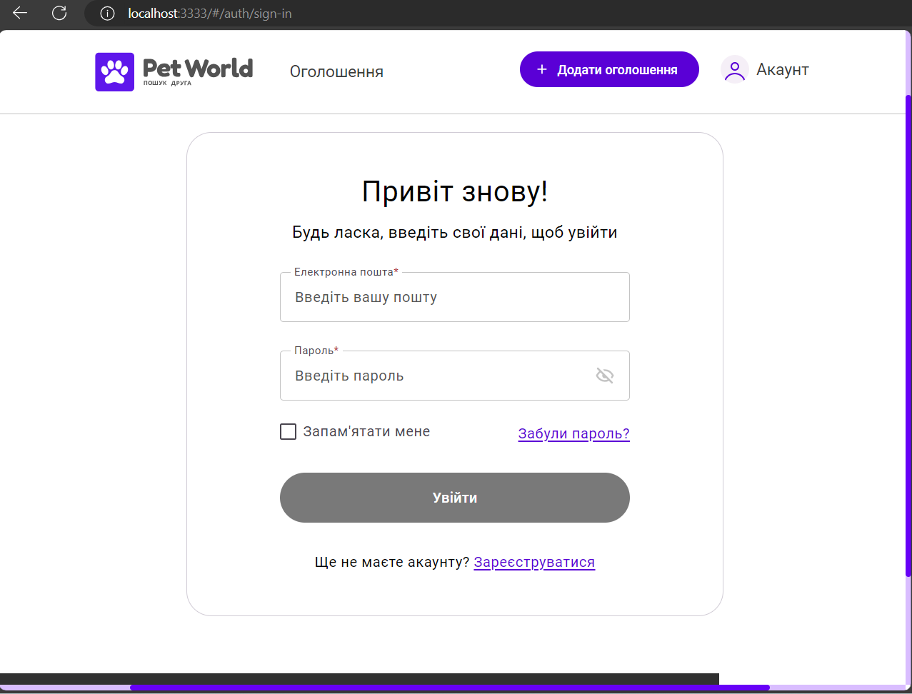
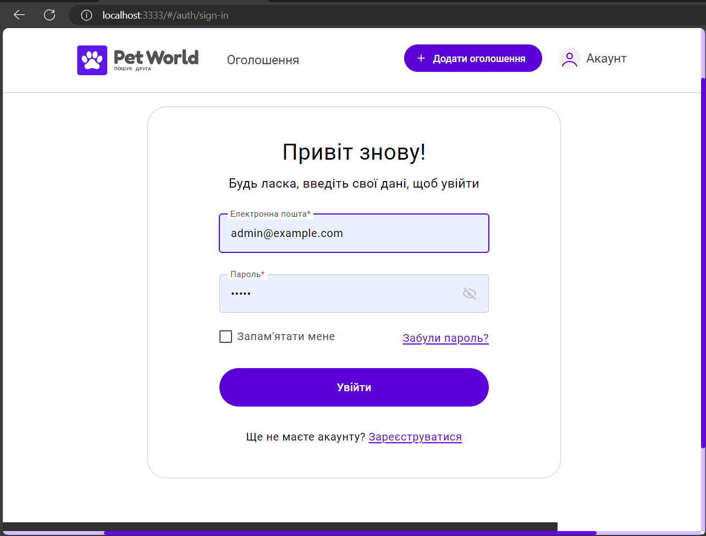
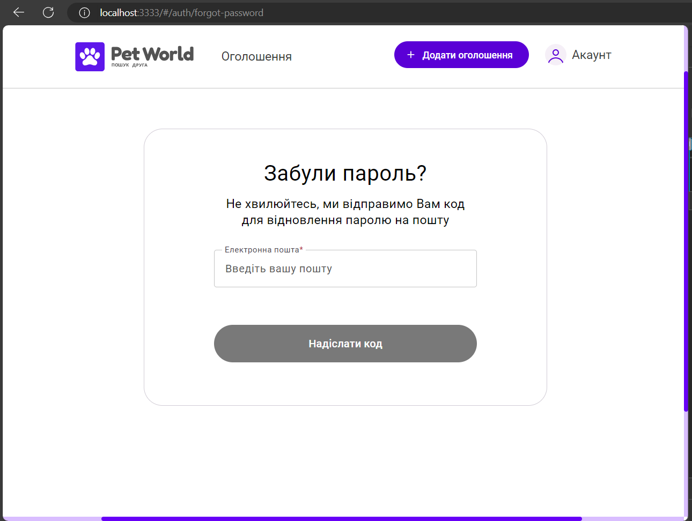
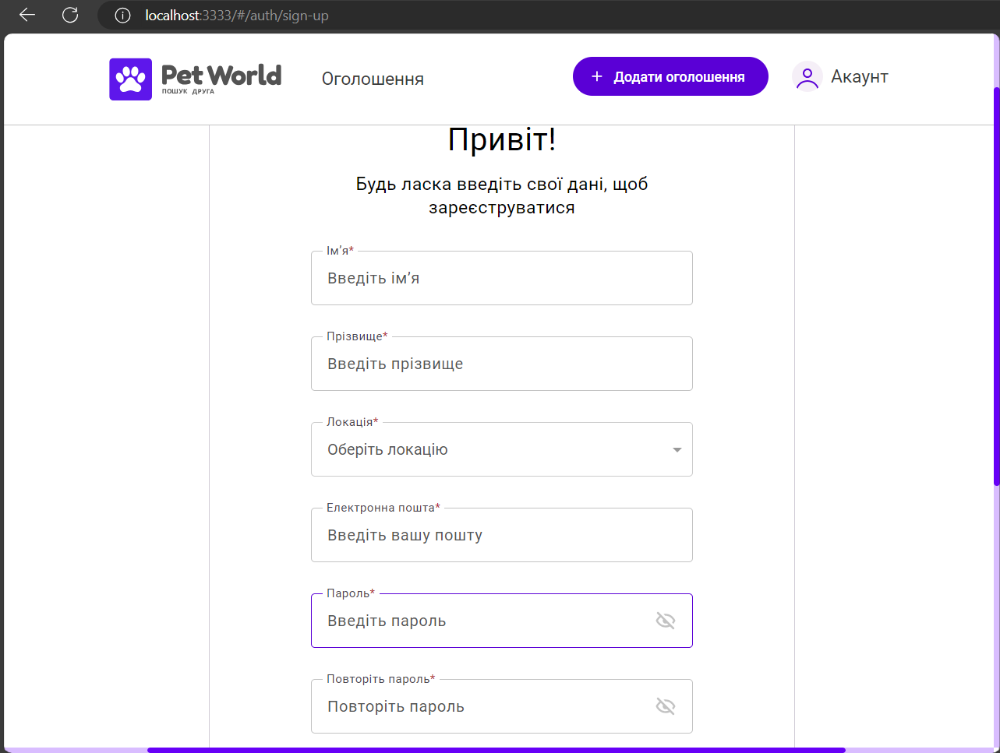

# Frontend related codebase

|Tool| Version |
|----|---------|
|Angular| 18.2 |

To run application, follow below steps:
1) npm install -g @angular/cli - install angular cli globally;
2) Install node js by following roles ^18.19.1 || ^20.11.1 || ^22.0.0 -  18.x but higher than 18.19.1, 20.x but higher than 20.11.1, 22.x but lower than 23.0.0
3) npm install - install all dependencies;
4) npm run run - run application;
5) in /src/app/services/api.service.ts change DOT_NET_API_URL and PYTHON_API_URL to your local backend url;

The folder with comparison of JS/React/Angular can be found at this path:
./src/app/comparison/

To run React project:
1) go to the following directory:
   ./src/app/comparison/react.js/
2) open terminal in this directory
3) run command 'npm install'
4) run command 'npm start'
5) open the link returned by the terminal in the browser
6) to add correct link to your backend:
  - go to the file: react.js/src/http.js
  - change variable BASE_URL to base url of your backend
  - adjust variables propertyDefinitionsUrl and proposalsUrl to use your backend endpoints if needed

# HOME WORK

## Sign-in page

### Links

### Logged

### Auth token

